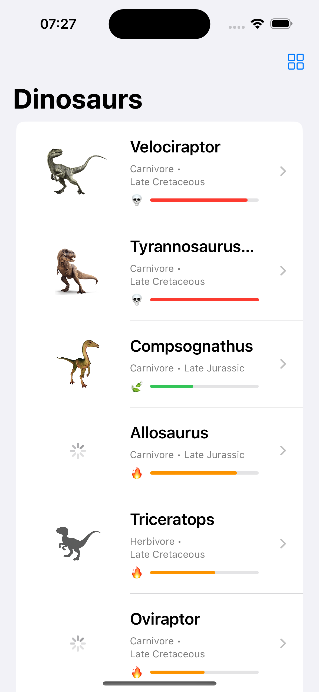
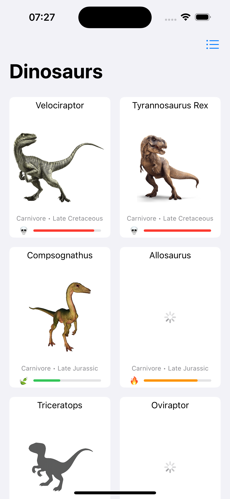
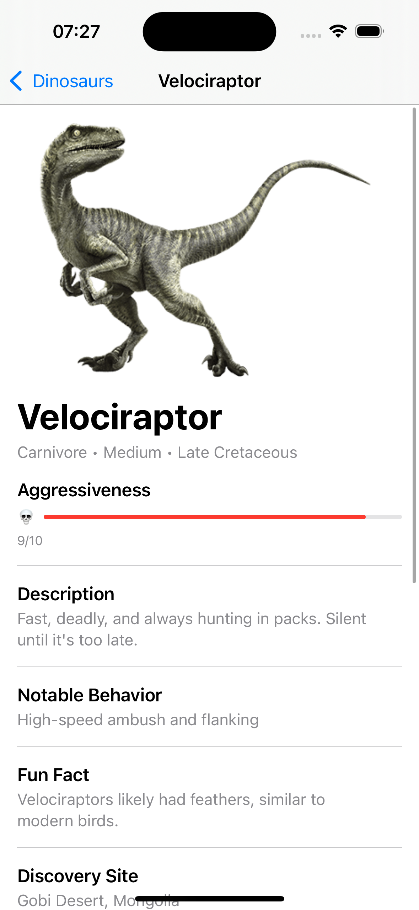
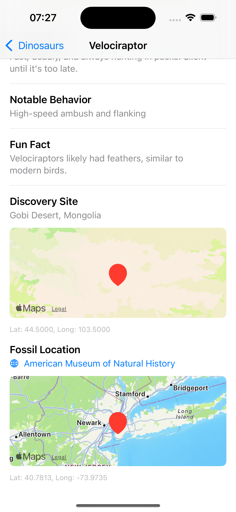
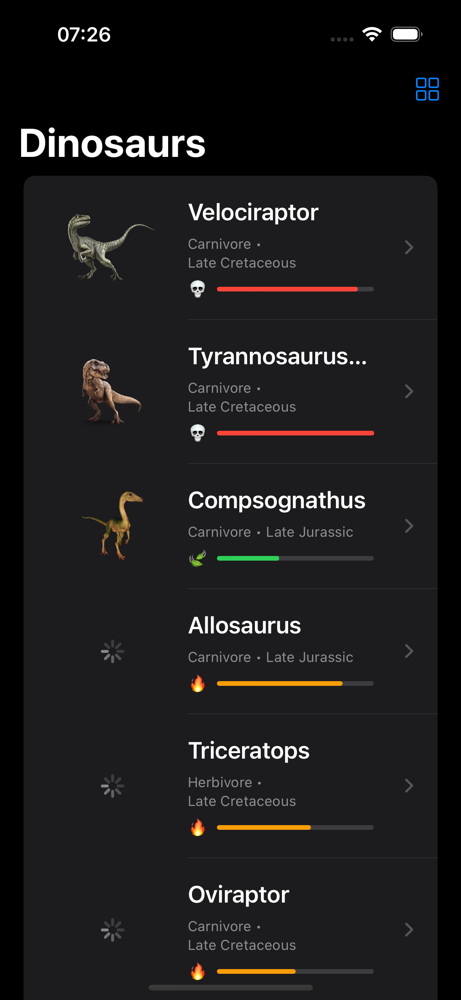
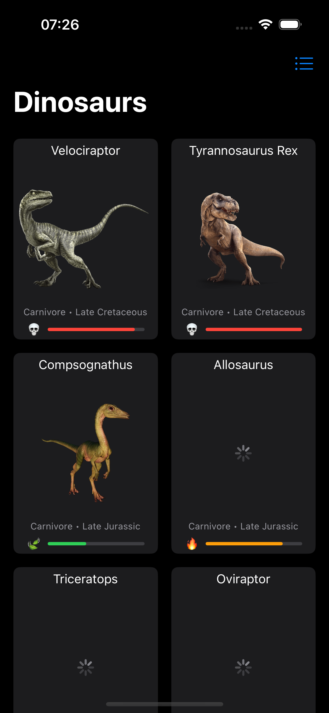
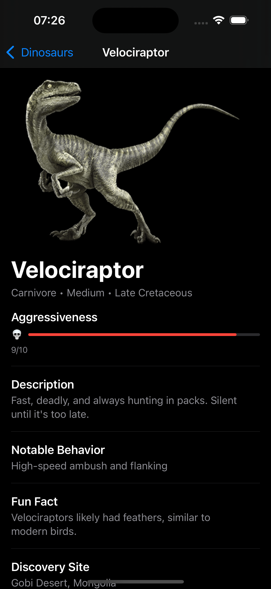
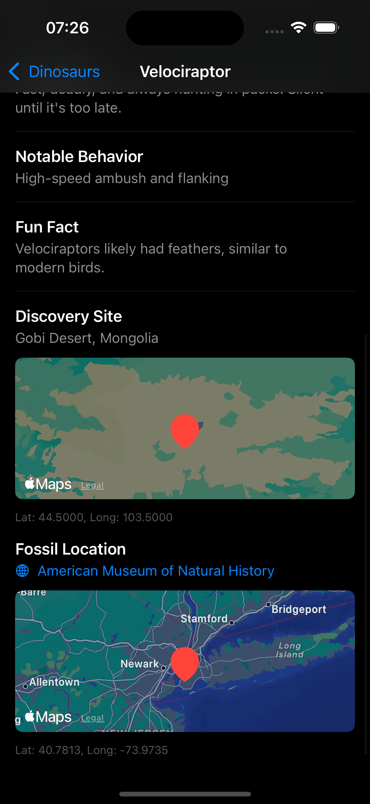

# Dino Bestiary
_A SwiftUI-based iOS app featuring a visual dinosaur bestiary_

![Platform][Platform] ![Language][Language] ![License][License]

## 📖 Overview

Dino Bestiary is a native iOS application crafted with SwiftUI that brings to life a vibrant collection of dinosaurs through custom-designed components and rich visual presentation. Data is locally sourced from JSON files and rendered in dynamic layouts, with support for both list and grid views.

The app embraces MVVM architecture, follows accessibility best practices, and includes localized strings for future internationalization. It is thoroughly tested across the board — including unit tests, UI tests, and snapshot tests — ensuring reliability and visual consistency on all supported devices, orientations, and color schemes.

Whether you’re browsing ancient predators or gentle herbivores, Dino Bestiary delivers a polished and immersive user experience — from launch screen to detail view.

> **📌 Note:** This project does not follow Clean Architecture.  
> Instead, it uses **MVVM**, separating concerns into **Domain**, **Data**, and **Presentation** layers to ensure cohesion and testability.

#### 🗂️ App Structure

```text
Dino Bestiary/
├── App/
│   └─── DinoBestiaryApp.swift       # App entry point
│
├── Configs/
│   └─┬─ Environment/                # App config, feature flags, environment variables
│     └─── <config>.swift
│
├── Data/
│   ├─┬─ Model/                      # Codable structs for JSON parsing
│   │ └─── <model name>.swift
│   └─┬─ Repository/                 # Concrete data loading (e.g., JSON)
│     └─── <repository class>.swift
│
├── Domain/
│   ├─┬─ Model/                       # Domain logic types (e.g., enums)
│   │ └─── <model name>.swift
│   └─┬─ Repository/                  # Protocols for abstraction
│     └─── <model name>.swift
│
├── Presentation/
│   ├─┬─ Core/                        # Shared UI Elements (e.g., styles, modifiers, components)
│   │ └─┬─ SharedComponents/          # Components shared across the app
│   │   └─── <component name>.swift
│   ├─┬─ <FEATURE NAME>/    
│   │ ├─── Components/                # Components used to compose the main view of the feature
│   │ ├─── <view_model class>.swift  
│   │ └─── <feature_name>View.swift
│   └── Utils/                        # UI Related Extensions, Constants, Adapters, etc
│
└── Utils/                            # Shared Extensions, Constants, Adapters, etc
```

## 🏗️ Architecture

> **📌 Note:** This project uses the MVVM (Model–View–ViewModel) pattern combined with clean principles, but it does not follow Clean Architecture strictly.

#### ❓ Why MVVM instead of Clean Architecture?

MVVM was chosen because it provides:

- Natural compatibility with SwiftUI through bindings and state management
- Less boilerplate and simpler structure compared to full Clean Architecture
- Easy to scale for small and medium projects without overengineering

#### 🧱 What about the layers: Data, Domain, and Presentation?

Although the codebase is structured into Data, Domain, and Presentation, this does not imply that Clean Architecture is being implemented.

These layers were chosen to:
	•	Keep the code modular and organized
	•	Promote single responsibility and testability
	•	Make it easier to visualize the separation of concerns between UI, data, and business logic

While the folder structure is inspired by Clean Architecture, the architecture remains intentionally simple and pragmatic:
	•	Views interact only with their ViewModels
	•	ViewModels access the necessary Models through Repositories

This lightweight approach keeps the architecture clean without adding unnecessary complexity or indirection.

## 🚀 Features

- Browse dinosaurs in list or grid view
- View detailed information, maps, and external references
- Local JSON data source with Codable parsing
- Support to light and dark mode
- Support to portrait and landscape orientations

## 🧪 Testing

The project includes:
- **Unit tests** for business logic and models
- **Snapshot tests** to ensure consistent UI
- **UI tests** using XCTest for navigation and flows

## 📸 Screenshots

<p align="center">
  
  
  
  
</p>

<p align="center">
  
  
  
  
</p>

## 📦 Installation

This project uses Swift Package Manager.  
To run it locally:

1. Clone the repo  
2. Open `DinoBestiary.xcodeproj`  
3. Build and run on Simulator or Device

## 📄 License

This project is licensed under the **Creative Commons Attribution-NonCommercial 4.0 International License**.  
See the [LICENSE](LICENSE.md) file for more information.

[Platform]: https://img.shields.io/badge/platform-iOS-lightgrey?logo=apple
[Language]: https://img.shields.io/badge/language-Swift-orange?logo=swift
[License]: https://img.shields.io/badge/license-CC--BY--NC--4.0-blue